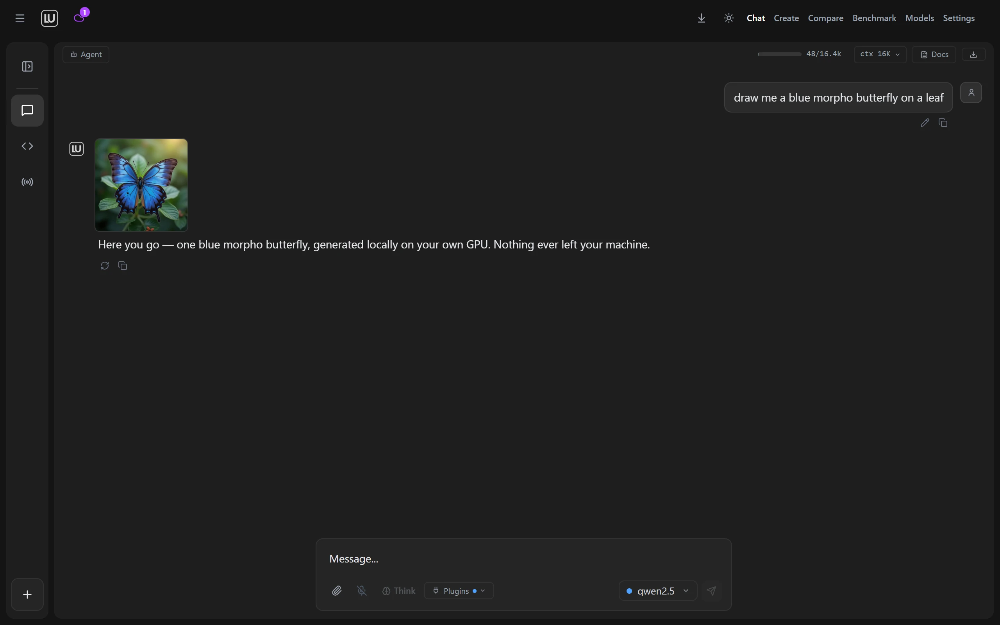
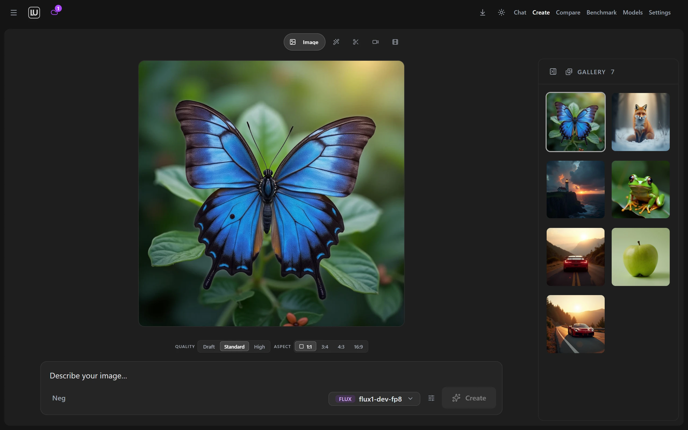
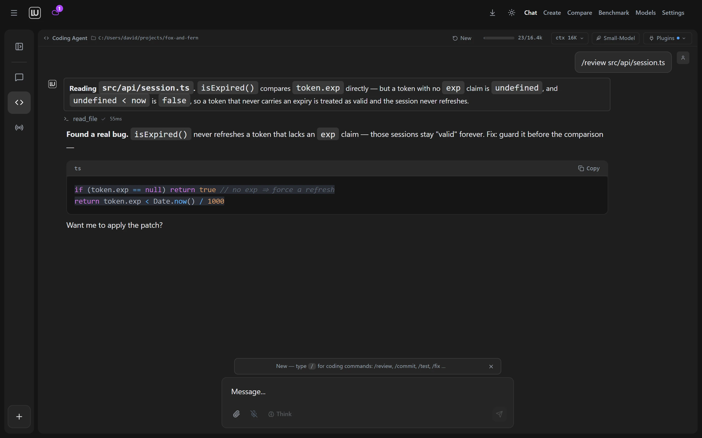
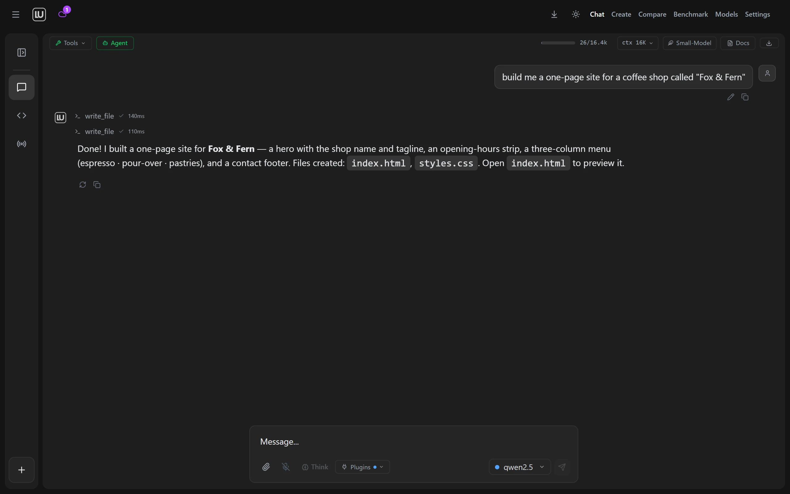

<div align="center">


# Locally Uncensored

**The plug-and-play local AI studio — uncensored chat, image & video generation, and a coding agent. One installer. No cloud.**

Install it like a normal app and you're chatting, generating images, and making videos in minutes. No command line, no Docker, no config files. Auto-detects 12 local backends. Your AI, your hardware, your rules.

[](https://www.gnu.org/licenses/agpl-3.0)
[](https://github.com/PurpleDoubleD/locally-uncensored/stargazers)
[](https://github.com/PurpleDoubleD/locally-uncensored/commits)
[](https://github.com/PurpleDoubleD/locally-uncensored/discussions)
[](https://locallyuncensored.com/discord)
[](https://locallyuncensored.com)


*The only desktop app that runs AI chat, image, and video generation — locally, one click, no cloud.*

[Download](#download) · [Quick Start](#quick-start) · [Features](#features) · [Why This App?](#why-locally-uncensored) · [Models](#recommended-models) · [FAQ](#faq)

</div>

---

## What is Locally Uncensored?

Locally Uncensored (LU) is a **free, open-source local AI studio** for Windows and Linux. It combines four things most local-AI tools keep separate — **AI chat, a coding agent, image generation, and video generation** — in one desktop app, and it installs like a normal program: run one installer, let the setup wizard detect (or install) an AI engine, one-click a model, start typing.

- **Uncensored by default** — first-class support for [abliterated models](https://locallyuncensored.com/blog/abliterated-models-guide.html) that answer directly, without refusals or lectures. Mainstream models are in the same menu.
- **100% local and private** — zero telemetry, zero analytics, works fully offline after model download. Cloud providers (OpenAI, Anthropic, OpenRouter, Groq…) are optional and use your own keys.
- **Plug and play** — auto-detects 12 local backends (Ollama, LM Studio, vLLM, KoboldCpp, Jan, llama.cpp, LocalAI, GPT4All, TabbyAPI, Aphrodite, SGLang, TGI). Nothing installed? One click installs the engine for you.
- **Free forever** — AGPL-3.0. The models are open weights. No subscription, no credits, no rate limits.

**New to local AI?** Start with the [5-minute beginner guide](https://locallyuncensored.com/blog/how-to-run-ai-locally.html) — no command line anywhere.

---

### Screenshots

| Chat that draws your images | Built-in image & video studio |
|:---:|:---:|
|  |  |
| **Coding Agent reviews & fixes** | **Agent Mode builds it for you** |
|  |  |

---

## Download

Grab the latest release from [**Releases**](https://github.com/PurpleDoubleD/locally-uncensored/releases/latest):

| Platform | File | Status |
|----------|------|--------|
| **Windows 10/11** | `.exe` (NSIS, recommended) or `.msi` | Fully tested, signed auto-update channel |
| **Linux** | `.deb` / `.rpm` / `.AppImage` | Packages on every release |
| macOS | — | Coming soon (source builds via `npm run tauri build`) |

> **Antivirus warning?** Some engines flag unsigned NSIS installers that download other binaries — a **false positive**. The installer is built by GitHub Actions from the public source on `master`, and the auto-update channel is signed against a public minisign key. Verification steps: [SECURITY.md](SECURITY.md#antivirus--browser-false-positives).

**Current release: v2.5.7** (July 2026) — portable-friendly installers for Windows and Linux (no admin rights required), now under the short in-app name **LU** by LU Labs. Full history in [Releases](https://github.com/PurpleDoubleD/locally-uncensored/releases) and [CHANGELOG.md](CHANGELOG.md).

---

## Quick Start

1. **Install** — download the installer and run it. No Docker, no terminal, no config files.
2. **Detect** — the first-launch wizard scans for all 12 supported local backends and offers one-click installs if none are running. ComfyUI (for images/video) is detected or installed the same way.
3. **Run** — pick a model in the Model Manager (hardware-aware recommendations, one-click downloads) and start chatting. Flip to the Coding Agent or the Create tab whenever you like.

Full walkthrough with screenshots: [Getting Started Guide](https://locallyuncensored.com/guide/).

<details>
<summary><strong>Build from source / contribute</strong></summary>

```bash
git clone https://github.com/PurpleDoubleD/locally-uncensored.git
cd locally-uncensored
npm install
npm run dev          # browser dev-mode (for contributing)
npm run tauri build  # production desktop binary
```

`setup.bat` (Windows) / `setup.sh` (Linux/macOS) bootstrap Node, Git, and Ollama for dev-mode. See the [Contributing Guide](CONTRIBUTING.md).

</details>

---

## Features

### Chat
- **Uncensored AI chat** — abliterated models with the refusal behavior removed from the weights (not a jailbreak). Streaming, thinking display, unlimited history.
- **20+ provider presets** — local: Ollama, LM Studio, vLLM, KoboldCpp, llama.cpp, LocalAI, Jan, TabbyAPI, GPT4All, Aphrodite, SGLang, TGI. Cloud (optional, your keys): OpenAI, Anthropic, OpenRouter, Groq, Together, DeepSeek, Mistral.
- **Thinking Mode** (provider-agnostic), **file upload with vision**, **memory system**, **Document Chat (RAG)** with local embeddings, **voice** (Whisper STT + neural TTS), **25+ personas**, chat import from ChatGPT/Claude/Gemini exports.

### Create — images & video
- **Image generation** via a bundled, auto-managed ComfyUI: FLUX 2 Klein, FLUX.1, Juggernaut XL, Z-Image Turbo (uncensored), ERNIE-Image, SDXL, SD 3.5. Per-model correct defaults — no node graphs, no config. [How it works](https://locallyuncensored.com/blog/easiest-local-ai-image-generator.html).
- **Video generation** — Wan 2.1/2.2, HunyuanVideo 1.5, LTX 2.3, AnimateDiff, CogVideoX. **Image-to-video** with FramePack F1 on just 6 GB VRAM. **Image-to-image** with denoise control.
- LoRA picker, VAE override, CLIP-skip, and a local gallery for everything you make. No content filter, no watermark, no credits.

### Code & agents
- **Coding Agent** — Architect mode, repo-map (Aider-style PageRank), review-before-apply diffs, test-runner loop, typed git/GitHub tools, multi-repo workspaces, per-project `.lurules`.
- **Agent Mode** — 28 tools + MCP: web search/fetch, file I/O, shell, code execution, screenshots, background tasks, parallel sub-agents. **Granular permissions** (7 categories, 3 levels).
- **Claude Code CLI integration** and universal tool calling — native for supported models, XML fallback for everything else.

### Everywhere
- **Remote access from your phone** — full mobile web app over LAN or Cloudflare Tunnel: QR pairing, 6-digit passcode, opt-in, visible connection status. [Details](https://locallyuncensored.com/blog/local-ai-on-your-phone.html).
- **A/B model compare**, **local benchmark**, hardware-aware model recommendations, model load/unload, auto-update over a signed channel.

---

## Why Locally Uncensored?

| Feature | Locally Uncensored | Open WebUI | LM Studio | Jan | SillyTavern |
|---------|:-:|:-:|:-:|:-:|:-:|
| AI Chat | **Yes** | Yes | Yes | Yes | Yes |
| Image Generation | **Yes** | No | No | No | Via ext. |
| Video Generation | **Yes** | No | No | No | No |
| Image-to-Image / Image-to-Video | **Yes** | No | No | No | No |
| Coding Agent | **Yes** | No | No | No | No |
| Agent Tools + MCP | **28 tools** | No | No | No | No |
| Plug & Play Backend Setup | **12 backends** | No | Built-in | Built-in | No |
| Remote Access (Phone) | **Yes** | Browser | No | No | Browser |
| A/B Compare + Benchmark | **Yes** | No | No | No | No |
| Uncensored by Default | **Yes** | No | No | No | Partial |
| Voice (STT + TTS) | **Yes** | Partial | No | No | Partial |
| Document Chat (RAG) | **Yes** | Yes | No | No | No |
| No Docker Required | **Yes** | No | Yes | Yes | Yes |
| Open Source | **AGPL-3.0** | Open | No | AGPL | AGPL |

Deep dives: [vs LM Studio](https://locallyuncensored.com/blog/locally-uncensored-vs-lm-studio.html) · [vs Jan](https://locallyuncensored.com/blog/locally-uncensored-vs-jan.html) · [vs Open WebUI](https://locallyuncensored.com/blog/locally-uncensored-vs-open-webui.html) · [vs GPT4All](https://locallyuncensored.com/blog/locally-uncensored-vs-gpt4all.html) · [vs Msty](https://locallyuncensored.com/blog/locally-uncensored-vs-msty.html) · [vs KoboldCpp](https://locallyuncensored.com/blog/locally-uncensored-vs-koboldcpp.html) · [vs SillyTavern](https://locallyuncensored.com/blog/locally-uncensored-vs-sillytavern.html) · [LM Studio alternatives](https://locallyuncensored.com/blog/lm-studio-alternatives.html) · [Best local AI apps 2026](https://locallyuncensored.com/blog/best-local-ai-apps-2026.html)

---

## Recommended Models

75+ one-click downloads in the Model Manager, filtered by what your hardware can run. Highlights:

### Text (any local backend)

| Model | VRAM | Best For |
|-------|------|----------|
| **Qwen 3.6 35B MoE** | 24 GB | Vision + agentic coding + thinking. 256K context. Day-0 support. |
| **Qwen 3.5 35B MoE** | 16 GB | Best agentic, SWE-bench leader. |
| **GLM-4.7-Flash IQ2** | 12 GB | Strongest 30B class. Tool calling, 198K context. |
| **Gemma 4 27B / E4B** | 16 / 4 GB | Google flagship — native tools + vision; E4B runs on small GPUs. |
| **GPT-OSS 120B / 20B** | via Ollama | OpenAI's open-weight models. |
| Llama 3.1 8B Abliterated | 6 GB | The classic uncensored starting point. |
| Hermes 3 8B | 6 GB | Uncensored + reliable tool calling for Agent Mode. |
| DeepSeek R1 (8B–70B) | 6–48 GB | Visible chain-of-thought reasoning. |

### Image (ComfyUI, auto-managed)

| Model | VRAM | Notes |
|-------|------|-------|
| FLUX.1 Schnell / Dev | 8–10 GB | Best text-to-image; fast or quality. |
| FLUX 2 Klein 4B | 8–10 GB | Next-gen, fastest FLUX. |
| Juggernaut XL V9 | 6 GB | Best photoreal SDXL — friendliest entry point. |
| Z-Image Turbo | 10–16 GB | Uncensored, 8–15 s per image. |
| ERNIE-Image Turbo | 24 GB | Baidu DiT, 8 steps. |

### Video (ComfyUI, auto-managed)

| Model | VRAM | Notes |
|-------|------|-------|
| Wan 2.1 T2V 1.3B / 14B | 8–10 / 12+ GB | Fast entry point → high quality 720p. |
| FramePack F1 (I2V) | 6 GB | Image-to-video on remarkably low VRAM. |
| LTX 2.3 | 10 GB | Fast text-to-video on modest hardware. |
| HunyuanVideo 1.5 | 12+ GB | Excellent temporal consistency. |
| AnimateDiff Lightning | 6–8 GB | Ultra-fast 4-step animation. |

---

## FAQ

**Is it really free and offline?**
Yes. AGPL-3.0, no account, no telemetry, no usage limits. After the initial model download the local stack works fully offline. Cloud providers are optional and bring-your-own-key.

**What does "uncensored" mean?**
Abliterated models have the trained-in refusal behavior removed from the weights themselves — not a jailbreak, nothing to patch or break. The model answers directly. Combined with local execution, your conversations stay private. [Full guide](https://locallyuncensored.com/blog/abliterated-models-guide.html).

**What hardware do I need?**
Text chat: 8 GB RAM. Fast 8B chat: a GPU with 6 GB VRAM. Image generation: NVIDIA GPU with 8+ GB VRAM. Video: 10–12 GB (image-to-video from 6 GB via FramePack F1). The app recommends models that fit your machine.

**Can it replace ChatGPT or Claude?**
For most chat, writing, and coding: yes, with a good 8–14B local model — private, unlimited, and refusal-free. Frontier cloud models are still stronger on the hardest reasoning; add them via your own API keys if you want both.

**Does remote access leak data?**
No. It's opt-in, passcode-gated, and shows connected devices. LAN traffic never leaves your network; away from home an encrypted Cloudflare tunnel connects phone and PC. No third-party AI server involved.

**macOS?**
Not yet — Windows and Linux today, macOS is on the roadmap. The source builds on macOS via `npm run tauri build` if you want to try.

---

## Roadmap

Everything from plug-and-play backend setup through the coding agent, Agent Mode (28 tools + MCP), image/video generation, remote access, voice, RAG, A/B compare, and signed auto-update has shipped — see [Releases](https://github.com/PurpleDoubleD/locally-uncensored/releases) for the full history.

**Next up:**
- [ ] Create-tab polish + new generation features (face-ID / PuLID, cleaner image & video workflow)
- [ ] Upscale + inpainting
- [ ] Voice Mode (live voice conversations)
- [ ] macOS build

---

## Tech Stack

**Tauri v2** (Rust backend, lightweight standalone binary) · **React 19 + TypeScript + Tailwind CSS 4** · **Vite 8** · ComfyUI for media, faster-whisper for STT · 20+ AI provider integrations.

## Community

Join the Discord: **https://locallyuncensored.com/discord** — help channels for chat, image gen, video gen, and the coding agent. Bugs and ideas: [Issues](https://github.com/PurpleDoubleD/locally-uncensored/issues/new?template=bug_report.yml) · [Discussions](https://github.com/PurpleDoubleD/locally-uncensored/discussions).

## License

AGPL-3.0 — see [LICENSE](LICENSE).

---

<div align="center">

**Your data stays on your machine.**

[Website](https://locallyuncensored.com) · [Beginner Guide](https://locallyuncensored.com/blog/how-to-run-ai-locally.html) · [Blog](https://locallyuncensored.com/blog/) · [Report Bug](https://github.com/PurpleDoubleD/locally-uncensored/issues/new?template=bug_report.yml) · [Request Feature](https://github.com/PurpleDoubleD/locally-uncensored/issues/new?template=feature_request.yml)

</div>
