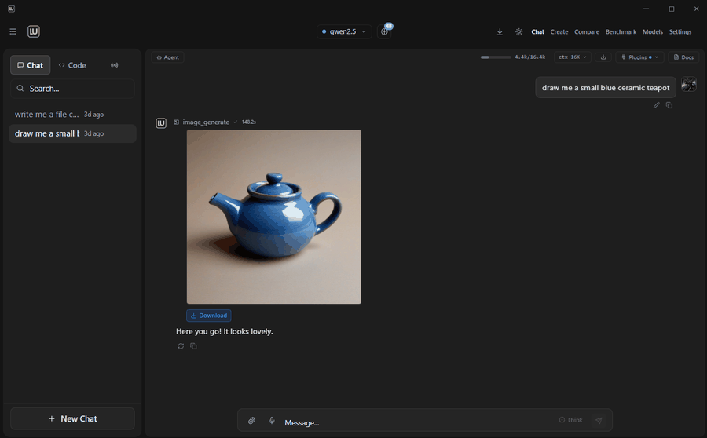

<div align="center">


# Locally Uncensored

**Generate anything — text, images, video. Locally. Uncensored.**

No cloud. No data collection. No API keys. Auto-detects 12 local backends. Your AI, your rules.

[](https://www.gnu.org/licenses/agpl-3.0)
[](https://github.com/PurpleDoubleD/locally-uncensored/stargazers)
[](https://github.com/PurpleDoubleD/locally-uncensored/commits)
[](https://github.com/PurpleDoubleD/locally-uncensored/discussions)
[](https://discord.gg/nHnGnDw2c8)
[](https://locallyuncensored.com)



*The only desktop app that runs AI chat, image, and video generation — locally, one click, no cloud.*

[Download](#-download) · [Features](#-features) · [Quick Start](#-quick-start) · [Why This App?](#-why-locally-uncensored) · [Roadmap](#-roadmap)

</div>

---

### Screenshots

| Chat with Personas | Image / Video Generation |
|:---:|:---:|
|  |  |
| **Model Manager** | **Create View with Parameters** |
|  |  |

---

## v2.3.9 — Current Release

**UX safety net: Create view no longer crashes when no image or video models are installed. Small docs refresh.**

Drop-in patch on top of v2.3.8.

### What's fixed
- **Create view: clean empty-state instead of a crash when no models are installed** — if you opened Create before downloading any ComfyUI model, the Create tab could go from unresponsive to a hard shutdown ("program disappears and a duplicate reopens"). Surfaced on Discord by @figuringitallout on a fresh Windows install. Root causes, both fixed: (1) `classifyModel()` was called with stale persisted model names that no longer existed on disk, (2) the main content area kept rendering `OutputDisplay` / `PromptInput` / `ParamPanel` against an empty model list. Create now detects this state and renders a calm empty-state card with a primary **Go to Model Manager** CTA and a **Refresh list** secondary action. Mode switcher stays available. Stale persisted image/video model names are proactively cleared by `useCreate.fetchModels` when ComfyUI reports 0 models in that category.
- **App always starts in the Chat tab on boot, not Code** — `codexStore` used to persist `chatMode` between sessions, so users who happened to end their last session in Codex / Claude Code would re-open the app inside an empty coding panel instead of the Chat homepage. Newcomers in particular landed in Code without any visible conversations and thought the app was broken. Fixed by excluding `chatMode` from the persisted slice — default `'lu'` (Chat) is used on every fresh boot; pick Code or Remote from the sidebar each session when you want them.
- **Header-level Create toggle + dropdown no longer crash on click** — the Lichtschalter and model picker in the app header (when you're on Create) used to crash with `TypeError: activeList is undefined` / `setComfyRunning is not a function`. Reported on Discord by @diimmortalis with a clean console-log dump. Four store fields (`imageModelList`, `videoModelList`, `comfyRunning`, `setComfyRunning`) that the component expected were never actually in the store — now they are, and they're populated by the same `useCreate.fetchModels` / `checkConnection` path the main Create view uses.
- **Backend Selector modal no longer reopens every 5-10 seconds** — users with multiple local backends (Ollama + LM Studio, Ollama + vLLM, etc) reported on Discord that the "N local backends detected" modal kept re-appearing no matter how often they dismissed it. Fix: a persistent `hideBackendSelector` flag in `providerStore`, a pre-checked "Don't show this again" tickbox in the modal, and a permanent pointer to **Settings → Providers** (clickable — it navigates you there) so users know where to manage providers going forward.
- **`classifyModel(name)` is null-safe** — defensive guard returns `unknown` if called with `null`, `undefined`, or non-string, so any path that reaches the classifier with a stale or missing model name degrades gracefully.
- **CONTRIBUTING.md dev workflow documented** — `npm run tauri:dev` / `npm run tauri:build` / `npm run dev` are now spelled out with the trade-off between them. Reported in Discord by @k-wilkinson (sourceodin) — thanks.

### Stability
- 2202 / 2202 Vitest tests green
- `cargo check` clean
- `tsc --noEmit` clean
- No breaking changes, no localStorage migration. Existing users see zero behavior change unless they previously hit the Create-with-no-models crash path.

## v2.3.8 — Previous Release

**Internal plumbing + UX polish. Drop-in patch on top of v2.3.7.**

No new headline features this release — internal stability work so future feature releases have a cleaner foundation.

### What's in this build
- **Built-in tool executors now thread the active chat-id through to the Rust backend** — `agent-context.ts` was designed for per-chat workspace isolation but the frontend executors (`fs_read`/`fs_write`/`fs_list`/`fs_search`/`shell_execute`/`execute_code`) never actually passed the id through, so relative paths silently landed in a shared fallback folder. Fixed end-to-end.
- **More robust tool-call JSON extraction** — the old greedy `\{[^}]*\}` regex failed on any nested brace or string value containing `{` (e.g. Python f-strings `f'Hello, {name}!'`). Replaced with a locate-header-then-balance scanner that respects string escapes. Fixes models that emit tool calls as JSON in `content` when the emitted code uses f-strings or dict literals.
- **Cleaner chat bubbles across models that emit tool calls in content** — new `stripRanges()` helper uses the balanced-brace positions the extractor already computes to remove the exact tool-call JSON substrings instead of a greedy regex that missed edge cases. No more stacked raw-JSON bubbles.
- **Concrete arg-validator error hints** — retry message now lists the exact required fields with types + the keys the model actually sent, so small models self-correct on the next iteration instead of repeating the same malformed call.
- **Family grouping in the model dropdown** (QWEN / GEMMA / LLAMA / HERMES / PHI / DOLPHIN / MISTRAL / DEEPSEEK / …) with reactive refresh when any provider's enabled state changes.
- **Development-only diagnostic code removed from the release binary** — devtools flag off for production, no file-writing loggers.

### Stability
- 2202 / 2202 Vitest tests green
- `cargo check` clean
- `tsc --noEmit` clean
- Drop-in upgrade from v2.3.7, no breaking changes, no localStorage migration

### Known work in progress
Codex (the coding-agent tab) is under active development. Several improvements landed in this release but the feature is still evolving — do not yet treat Codex as production-finished. Chat, Create, Agent Mode, and Remote remain stable.

### What's still in v2.3.8 from v2.3.7
v2.3.7's remote Ollama + `OLLAMA_HOST` env var support, v2.3.6's configurable ComfyUI host, LM Studio / OpenAI-compat CORS fix, and ComfyUI port persistence all remain in place.

### Remote Access + Mobile Web App
- **Access your AI from your phone** — Dispatch via LAN or Cloudflare Tunnel (Internet)
- **Full mobile web app** — Hamburger drawer, chat list, Codex mode, file attach, thinking toggle, Plugins (Caveman + Personas)
- **Mobile Agent Mode** — 13 tools with Thought/Action/Observation cards
- **Security hardened** — 6-digit passcodes, rate limiting, JWT auth, permissions enforced, CSP headers

### Codex Coding Agent — Major Upgrade
- **Live streaming** between tool calls — see tokens as they generate
- **Continue capability** — tool-call history persisted, model remembers previous actions
- **AUTONOMY CONTRACT** — model completes ALL steps without premature stopping
- **Fallback answer** — never shows empty bubble after tool calls

### Agent Mode — 13-Phase Rewrite
- **Parallel tool execution** with side-effect grouping
- **Budget system** — max 50 tool calls / 25 iterations per task
- **Sub-agent delegation** — `delegate_task` spawns isolated sub-agents
- **MCP integration** — external tools via ToolRegistry
- **Filesystem awareness** — agent uses file_list/system_info before acting

### New Models + Image Gen
- **Qwen 3.6** (day-0) — 35B MoE, vision + agentic coding + thinking. One-click download
- **ERNIE-Image** (Baidu) — Turbo (8 steps) + Base (50 steps). Plug & play, no custom nodes
- **Image-to-Image** — Upload source, adjust denoise, transform with any model
- **75+ downloadable models** — all URLs verified

### UI/UX
- **AE-style text header** — clean typography for better discoverability
- **Plugins dropdown** — Caveman Mode + Personas in one menu
- **Thinking mode** — tri-state, auto-retry, universal tag stripper
- **2166 tests** — comprehensive smoke tests covering the entire app

---

## Why Locally Uncensored?

| Feature | Locally Uncensored | Open WebUI | LM Studio | SillyTavern |
|---------|:-:|:-:|:-:|:-:|
| AI Chat | **Yes** | Yes | Yes | Yes |
| **Coding Agent (Codex)** | **Yes** | No | No | No |
| **14 Agent Tools + MCP** | **Yes** | No | No | No |
| **Plug & Play Setup** | **12 Backends** | No | Built-in | No |
| **Multi-Provider** (20+ Presets) | **Yes** | Yes | Yes | No |
| **A/B Model Compare** | **Yes** | No | No | No |
| **Local Benchmark** | **Yes** | No | No | No |
| Image Generation | **Yes** | No | No | No |
| **Image-to-Image** | **Yes** | No | No | No |
| **Image-to-Video** | **Yes** | No | No | No |
| Video Generation | **Yes** | No | No | No |
| **File Upload + Vision** | **Yes** | Yes | Yes | No |
| **Thinking Mode** | **Yes** | No | No | No |
| **Granular Permissions** | **7 Categories** | No | No | No |
| Uncensored by Default | **Yes** | No | No | Partial |
| Memory System | **Yes** | Plugin | No | No |
| Agent Workflows | **Yes** | No | No | No |
| Document Chat (RAG) | **Yes** | Yes | No | No |
| Voice (STT + TTS) | **Yes** | Partial | No | No |
| **Remote Access (Phone)** | **Yes** | No | No | No |
| **Plugins (Caveman + Personas)** | **Yes** | No | No | Yes |
| **Auto-Update** | **Yes** | No | Yes | No |
| Open Source | **AGPL-3.0** | MIT | No | AGPL |
| No Docker | **Yes** | No | Yes | Yes |

---

## Features

### Core
- **Plug & Play Setup** — First-launch wizard auto-detects 12 local backends. Nothing installed? One-click in-app Ollama download and install with progress bar. ComfyUI one-click install with step-by-step progress. Configurable ComfyUI port and path in Settings. Zero config needed.
- **Uncensored AI Chat** — Abliterated models with zero restrictions. Streaming + thinking display.
- **Multi-Provider** — 20+ presets. Local: Ollama, LM Studio, vLLM, KoboldCpp, llama.cpp, LocalAI, Jan, TabbyAPI, GPT4All, Aphrodite, SGLang, TGI. Cloud: OpenAI, Anthropic, OpenRouter, Groq, Together, DeepSeek, Mistral. Switch per conversation.
- **Codex Coding Agent** — Live streaming between tool calls, continue capability, AUTONOMY CONTRACT. File tree, folder picker, up to 50 iterations.
- **Agent Mode** — 14 tools + MCP: web search/fetch, file I/O, shell, code execution, screenshots, system info, time. Parallel execution, sub-agents, budget system.
- **Remote Access** — Access your AI from your phone via LAN or Cloudflare Tunnel. Full mobile web app with Agent Mode, Codex, plugins, file attach.
- **Image Generation** — FLUX 2 Klein, FLUX.1 (schnell/dev), Z-Image Turbo/Base, Juggernaut XL, RealVisXL, DreamShaper XL via ComfyUI. Full parameter control, no content filter.
- **Image-to-Image** — Upload a source image, adjust denoise strength, transform with any image model.
- **Video Generation** — Wan 2.1, HunyuanVideo 1.5, LTX 2.3, AnimateDiff Lightning, CogVideoX, FramePack F1 on your GPU.
- **Image-to-Video** — FramePack F1 (6 GB VRAM), CogVideoX 5B, SVD-XT. Upload an image, get video.

### Intelligence
- **Thinking Mode** — Provider-agnostic. See the AI's reasoning before the answer. Toggle from chat input.
- **File Upload + Vision** — Drag & drop, paste, clip button. Vision models analyze images.
- **Granular Permissions** — 7 tool categories, 3 permission levels, per-conversation overrides.
- **Smart Tool Selection** — Reduces tool definitions per request by ~80%. JSON repair for local LLMs.
- **Memory System** — Persistent across conversations. Auto-extraction. Export/import.
- **Agent Workflows** — Multi-step chains. 3 built-in (Research, Summarize URL, Code Review). Visual builder.

### Productivity
- **Model A/B Compare** — Same prompt, two models, side by side. Parallel streaming.
- **Local Benchmark** — One-click benchmark any model. Tokens/sec leaderboard.
- **Document Chat (RAG)** — Upload PDFs, DOCX, TXT. Hybrid search with source citations.
- **Voice Chat** — Push-to-talk STT + sentence-level TTS streaming.
- **20+ Personas** — Pre-built characters. Switch without prompt engineering.
- **Chat Export** — Markdown or JSON. Token counter. Keyboard shortcuts.

### Customization
- **Plugins Dropdown** — Caveman Mode (Off/Lite/Full/Ultra for terse responses) + 20+ Personas in one menu. Per-chat. Works in Chat, Agent, Codex.
- **Auto-Update** — Signed NSIS installer. In-app download with progress bar. User-controlled restart (no forced updates). Settings survive updates.

### Polish
- **Standalone Desktop App** — Tauri v2 Rust backend. Download .exe, run it.
- **Model Load/Unload** — iOS-style toggle in header. Load into VRAM, unload when done.
- **AE-Style Header** — Clean typography navigation. Models, Settings, Downloads at a glance.
- **Privacy First** — Zero tracking, all API calls proxied locally. ComfyUI process auto-killed on app close.

## Tech Stack

- **Desktop**: Tauri v2 (Rust backend, standalone .exe)
- **Frontend**: React 19, TypeScript, Tailwind CSS 4, Framer Motion
- **State**: Zustand with localStorage persistence
- **AI Backend**: 20+ providers (Ollama, LM Studio, vLLM, KoboldCpp, llama.cpp, LocalAI, Jan, OpenAI, Anthropic, OpenRouter, Groq, and more), ComfyUI, faster-whisper
- **Build**: Vite 8 (dev), Tauri CLI (production)

---

## Download

### Windows
Download the installer from [Releases](https://github.com/PurpleDoubleD/locally-uncensored/releases/latest):
- **`.exe`** — NSIS installer (recommended)
- **`.msi`** — Windows Installer

> **Other platforms:** The source code builds on Linux and macOS via `npm run tauri build`, but only Windows is officially tested and supported.

> **Plug & Play:** Just install and launch. The setup wizard auto-detects all 12 supported local backends ([Ollama](https://ollama.com/), [LM Studio](https://lmstudio.ai/), [vLLM](https://github.com/vllm-project/vllm), [KoboldCpp](https://github.com/LostRuins/koboldcpp), llama.cpp, LocalAI, Jan, GPT4All, text-generation-webui, TabbyAPI, Aphrodite, SGLang). Nothing installed yet? The wizard shows one-click install links for every backend.

---

## Quick Start

> **New to Locally Uncensored?** Read the [Getting Started Guide](https://locallyuncensored.com/guide/) with screenshots for every step.

### From Source

```bash
git clone https://github.com/PurpleDoubleD/locally-uncensored.git
cd locally-uncensored
npm install
npm run dev
```

### For Contributors — Dev-Mode Setup

> ⚠️ **Just want to use the app?** Grab the installer from [Releases](https://github.com/PurpleDoubleD/locally-uncensored/releases/latest) (the `.exe` or `.msi` in the **Download** section above). That gives you the full Tauri desktop app with auto-update. The commands below start LU in **browser dev-mode** — fewer features, Vite proxy noise, meant for contributing to the codebase.

```bash
git clone https://github.com/PurpleDoubleD/locally-uncensored.git
cd locally-uncensored
setup.bat   # Windows — installs Node, Git, Ollama, then npm run dev
# setup.sh  # macOS / Linux equivalent
```

Launches at `http://localhost:5173` in your default browser.

### Image & Video Generation

Open the **Create** tab. ComfyUI is auto-detected or one-click installed. Models download with one click. Workflow is set to **Auto** — just write a prompt and hit Generate.

---

## Recommended Models

### Text (any local backend)

| Model | VRAM | Best For |
|-------|------|----------|
| **Qwen 3.6 35B MoE** | 24 GB | Vision + agentic coding + thinking. Brand new. |
| **GLM-4.7-Flash IQ2** | 12 GB | Strongest 30B class. Tool calling. 198K context. |
| **Gemma 4 E4B** | 4 GB | Lightweight, fast, great for small GPUs. |
| **Qwen 3.5 35B MoE** | 16 GB | Best agentic, 256K context. SWE-bench leader. |
| **Gemma 4 31B** | 16 GB | Frontier dense model, native tools + vision. |
| Hermes 3 8B | 6 GB | Agent Mode. Uncensored + tool calling. |
| DeepSeek R1 (8B-70B) | 6-48 GB | Chain-of-thought reasoning. |

### Image (ComfyUI)

| Model | VRAM | Notes |
|-------|------|-------|
| FLUX.1 Schnell / Dev | 8-10 GB | Best text-to-image. Fast (schnell) or quality (dev). |
| FLUX 2 Klein 4B | 8-10 GB | Next-gen, fastest FLUX model. |
| ERNIE-Image Turbo | 24 GB | Baidu DiT, 8 steps, 1024x1024. New. |
| Z-Image Turbo | 10-16 GB | Uncensored, 8-15 sec per image. |
| Juggernaut XL V9 | 6 GB | Best photorealistic SDXL. |

### Video (ComfyUI)

| Model | VRAM | Notes |
|-------|------|-------|
| Wan 2.1 T2V 1.3B | 8-10 GB | Fast entry point, 480p. |
| Wan 2.1 T2V 14B | 12+ GB | High quality, 720p. |
| FramePack F1 (I2V) | 6 GB | Image-to-video, revolutionary low VRAM. |
| AnimateDiff Lightning | 6-8 GB | Ultra-fast 4-step animation. |
| HunyuanVideo 1.5 | 12+ GB | Excellent temporal consistency. |

---

## Roadmap

- [x] **Plug & Play Setup** (auto-detect 12 local backends, one-click install links)
- [x] Codex Coding Agent
- [x] MCP Tool Registry (13 tools)
- [x] Granular Permissions (7 categories)
- [x] File Upload + Vision
- [x] Thinking Mode (provider-agnostic)
- [x] Model Load/Unload from header
- [x] Multi-Provider (20+ presets)
- [x] Agent Mode + Workflows
- [x] Memory System
- [x] A/B Compare + Local Benchmark
- [x] RAG / Document Chat
- [x] Voice Chat (STT + TTS)
- [x] ComfyUI Plug & Play (auto-detect, one-click install)
- [x] 20 Image + Video Model Bundles
- [x] Image-to-Image (I2I)
- [x] Image-to-Video (I2V) — FramePack, CogVideoX, SVD
- [x] Z-Image + FLUX 2 + ERNIE-Image support
- [x] Dynamic Workflow Builder (15 strategies)
- [x] VRAM-Aware Model Filtering
- [x] Think Mode in Chat Input
- [x] Remote Access (LAN + Cloudflare Tunnel)
- [x] Mobile Web App (Agent, Codex, Plugins, Thinking)
- [x] Codex Streaming + Continue + Autonomy Contract
- [x] Agent 13-Phase Rewrite (parallel, budget, sub-agents, MCP)
- [x] Auto-Update (signed NSIS installer)
- [x] Qwen 3.6 Day-0 Support
- [x] Plugins Dropdown (Caveman + Personas)
- [ ] Voice Mode (Qwen Omni live voice)
- [ ] Upscale + Inpainting

---

## Build from Source

```bash
git clone https://github.com/PurpleDoubleD/locally-uncensored.git
cd locally-uncensored
npm install
npm run dev          # Development
npm run tauri build  # Production binary
```

## Platform Support

| Platform | Status | Download |
|----------|--------|----------|
| **Windows** (10/11) | Fully tested | `.exe` / `.msi` |
| Linux / macOS | Build from source | `npm run tauri build` |

## Community

Join the Discord: **https://discord.gg/nHnGnDw2c8**. Ask questions, share what you built, or help others in our forum channels — chat / image gen / video gen / coding agent.

## Contributing

Check out the [Contributing Guide](CONTRIBUTING.md). See [open issues](https://github.com/PurpleDoubleD/locally-uncensored/issues) or the [Roadmap](#-roadmap).

## License

AGPL-3.0 License — see [LICENSE](LICENSE).

---

<div align="center">

**Your data stays on your machine.**

[Website](https://locallyuncensored.com) · [Report Bug](https://github.com/PurpleDoubleD/locally-uncensored/issues/new?template=bug_report.yml) · [Request Feature](https://github.com/PurpleDoubleD/locally-uncensored/issues/new?template=feature_request.yml) · [Discussions](https://github.com/PurpleDoubleD/locally-uncensored/discussions)

</div>
